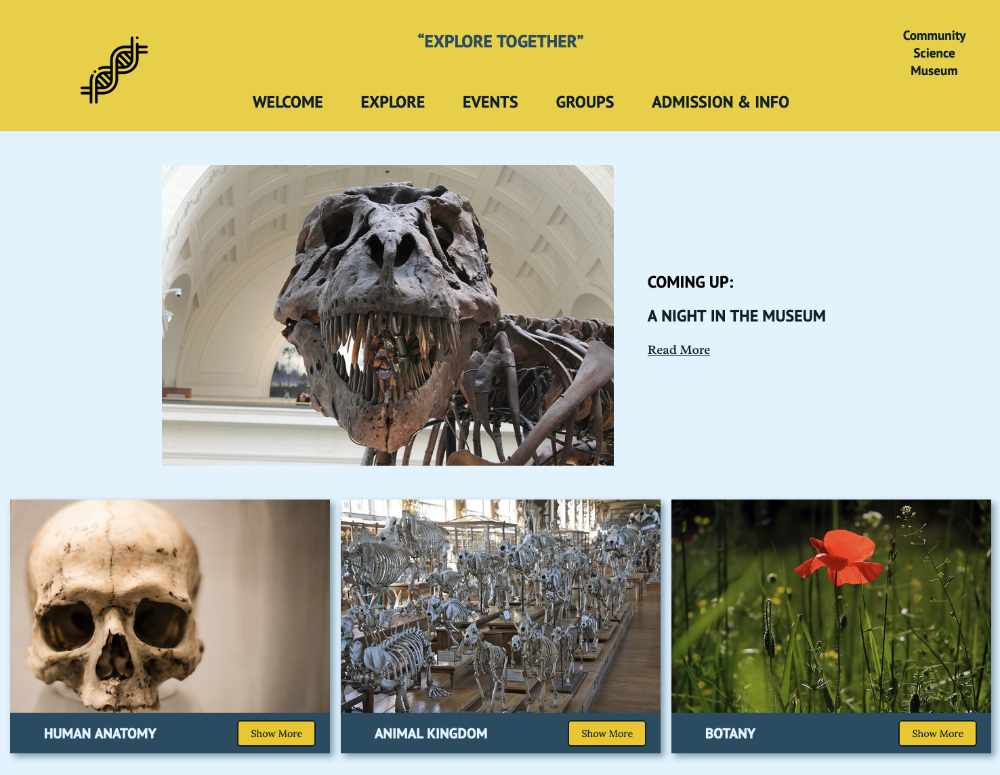

# Community Science Museum

## Explore together



This is a website for a Community Science Muesum that I created for semester project at Noroff. The task was to create an informative and engaging website using HTML and CSS, and make it responsive.

## Built with

This website is built with pure HTML and CSS.

## Getting started

Clone this respository.

```
git clone git@github.com:zalacop/semester-project-zalacop.git
```

You can run this application using your favourite server.
